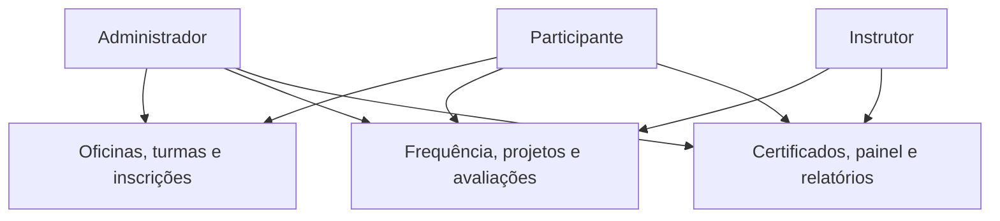

# Casos de uso

## Atores

| Ator | Descrição |
|---|---|
| Administrador | Mantém a operação, configura ofertas e acompanha resultados. |
| Instrutor | Conduz as turmas às quais está atribuído. |
| Participante | Solicita e acompanha sua participação nas oficinas. |
| Serviço de e-mail | Entrega mensagens de recuperação de senha e, futuramente, avisos. |

## Catálogo

| ID | Caso de uso | Ator principal |
|---|---|---|
| UC-001 | Autenticar e encerrar sessão | Todos os usuários |
| UC-002 | Gerenciar usuários e permissões | Administrador |
| UC-003 | Gerenciar participantes, responsáveis e instrutores | Administrador |
| UC-004 | Gerenciar oficinas e turmas | Administrador |
| UC-005 | Planejar encontros | Administrador |
| UC-006 | Solicitar ou registrar inscrição | Participante/Administrador |
| UC-007 | Processar inscrição e lista de espera | Administrador |
| UC-008 | Registrar frequência | Instrutor/Administrador |
| UC-009 | Registrar projeto | Participante/Instrutor |
| UC-010 | Avaliar e concluir participantes | Instrutor/Administrador |
| UC-011 | Emitir e consultar certificado | Sistema/Participante |
| UC-012 | Consultar painel e relatórios | Administrador/Instrutor |

## UC-006 — Solicitar inscrição

**Objetivo:** vincular um participante elegível a uma turma aberta.

**Pré-condições:** usuário autenticado; participante ativo; turma com inscrições abertas.

**Fluxo principal:**

1. O participante consulta as turmas disponíveis.
2. Seleciona uma turma e visualiza informações, datas, vagas e critérios.
3. Solicita a inscrição.
4. O sistema verifica duplicidade, idade, responsável legal, prazo e situação da turma.
5. O sistema cria a inscrição como pendente.
6. O sistema apresenta a confirmação e a situação atual.

**Alternativas:**

- A1: se não houver vaga e a lista estiver habilitada, a inscrição entra na lista de espera;
- A2: se os dados forem inválidos, nenhuma inscrição é criada e as pendências são informadas;
- A3: se já existir inscrição, o registro existente é apresentado.

**Pós-condição:** existe uma única inscrição do participante para a turma, em situação coerente com a capacidade.

## UC-007 — Processar inscrição

**Objetivo:** confirmar, rejeitar ou organizar inscrições aguardando decisão.

**Pré-condições:** administrador autenticado; inscrição pendente ou em espera.

**Fluxo principal:**

1. O administrador abre a fila da turma.
2. O sistema apresenta vagas, inscrições pendentes e espera ordenada.
3. O administrador seleciona uma inscrição elegível.
4. O sistema revalida elegibilidade e capacidade dentro de uma transação.
5. O administrador confirma a inscrição.
6. O sistema ocupa a vaga e registra autoria e data.

**Alternativas:** sem vaga, mantém ou move para espera; inelegibilidade, rejeita com motivo; promoção fora da ordem exige justificativa.

## UC-008 — Registrar frequência

**Objetivo:** registrar a chamada de um encontro realizado.

**Pré-condições:** encontro da turma; instrutor vinculado ou administrador; inscrições confirmadas.

**Fluxo principal:**

1. O ator seleciona turma e encontro.
2. O sistema lista os participantes confirmados.
3. O ator marca presente, ausente ou falta justificada.
4. O sistema valida um resultado por participante.
5. O sistema salva chamada, autoria e horário e marca o encontro como realizado.
6. Uma correção atualiza o mesmo registro, sem criar duplicidade.
7. O percentual de frequência é recalculado na consulta.

**Alternativas:** encontro cancelado ou futuro não aceita chamada; ator sem vínculo recebe acesso negado.

## UC-010 — Avaliar e concluir participante

**Objetivo:** registrar o resultado final e determinar a conclusão.

**Pré-condições:** turma encerrando; encontros processados; ator autorizado.

**Fluxo principal:**

1. O instrutor consulta o resumo do participante.
2. O sistema exibe frequência e estado do projeto.
3. O instrutor registra nota e devolutiva.
4. O sistema valida a nota.
5. Ao concluir a turma, o sistema calcula o resultado de cada inscrição.
6. Participantes que cumprem todos os critérios são aprovados.
7. Os demais são marcados como não concluídos, com motivos.
8. O sistema habilita certificado apenas para aprovados.

## UC-012 — Consultar indicadores

**Objetivo:** apoiar acompanhamento e prestação de contas.

**Fluxo principal:**

1. O ator abre o painel.
2. O sistema aplica automaticamente seu escopo de acesso.
3. O ator informa filtros permitidos.
4. O sistema apresenta totais, ocupação, frequência média, conclusão e projetos entregues.
5. O administrador pode abrir a listagem de origem e exportar dados permitidos.

## Diagrama de casos de uso simplificado

