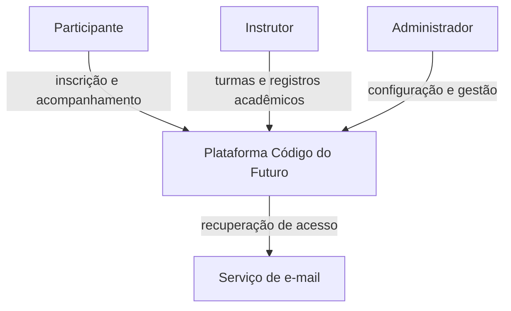
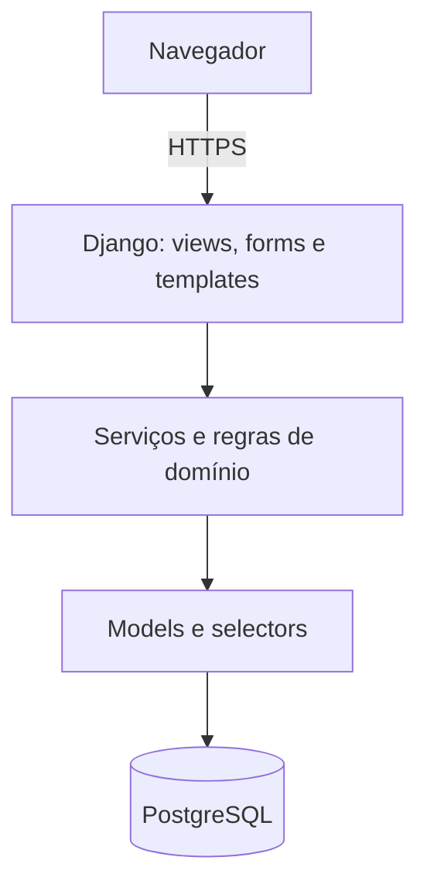
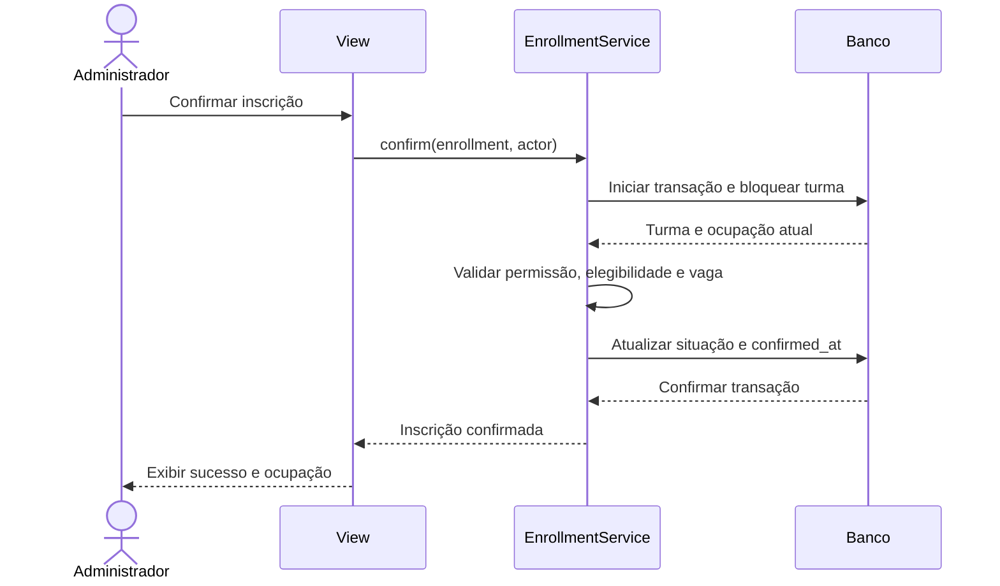
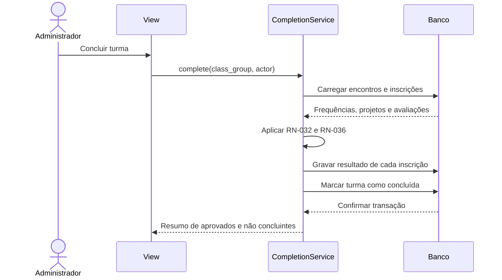
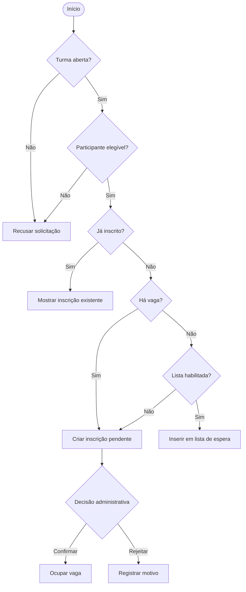

# Diagramas do sistema

Os diagramas são mantidos em Mermaid para permanecerem versionáveis e fáceis de atualizar conforme a implementação.

## Contexto

## Componentes lógicos

## Sequência: confirmação de inscrição

## Sequência: conclusão da turma

## Atividade: jornada da inscrição

## Manutenção dos diagramas

Qualquer mudança em estados, atores ou limites dos módulos deve atualizar este arquivo e o documento relacionado antes da implementação.
