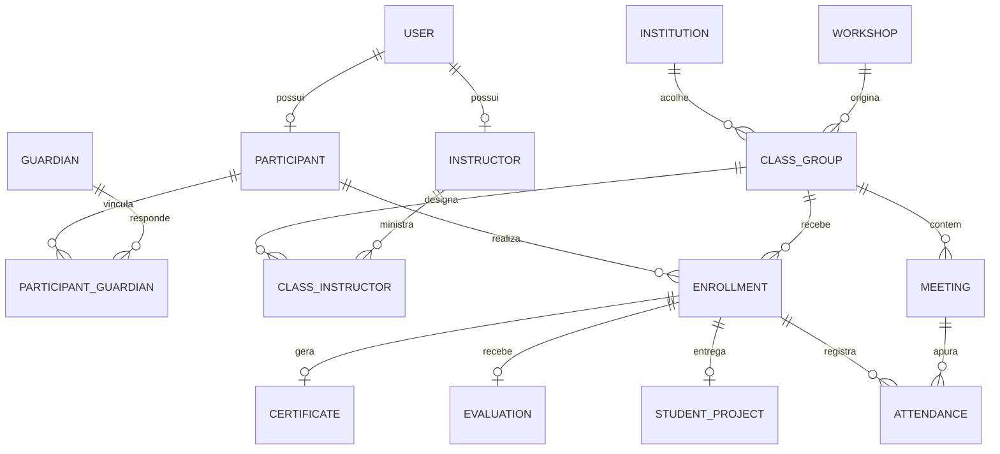
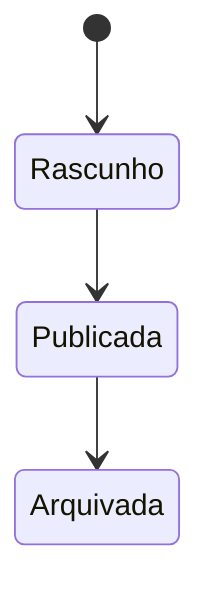
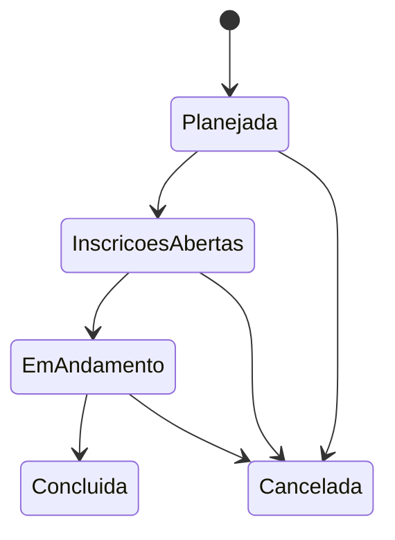
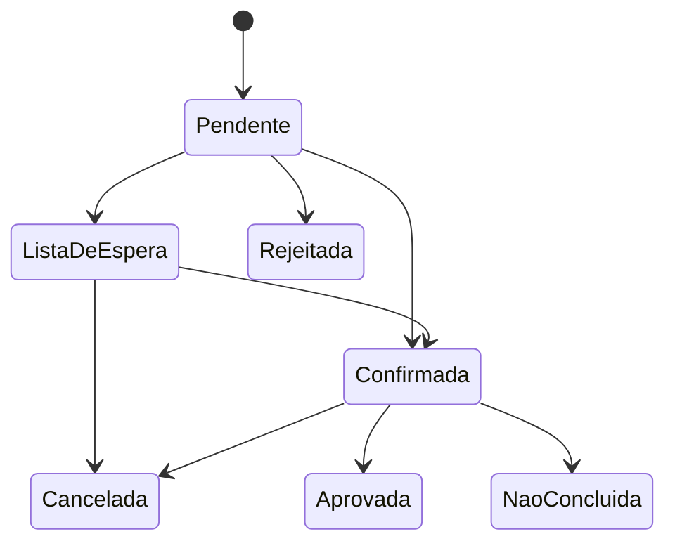

# Modelo de dados

## Decisões de modelagem

1. `User` será o modelo autenticável e usará e-mail como identificador.
2. Dados específicos ficam em perfis de participante e instrutor.
3. Oficina e turma são entidades separadas para permitir várias edições da mesma oferta.
4. Inscrição concentra a jornada e não é apagada após confirmação.
5. Frequência usa unicidade entre inscrição e encontro.
6. Situações são valores controlados no código e protegidos por validações e restrições quando possível.
7. Datas de criação e alteração usam campos comuns herdados de um modelo abstrato.

## Modelo conceitual

## Entidades e responsabilidades

| Entidade | Responsabilidade |
|---|---|
| User | identidade, autenticação, situação e perfil de acesso |
| Participant | dados pessoais e acadêmicos do jovem |
| Guardian | dados mínimos do responsável legal |
| ParticipantGuardian | vínculo e indicação de responsável principal |
| Instructor | apresentação e especialidades do instrutor |
| Institution | identificação do parceiro e local de referência |
| Workshop | definição pedagógica reutilizável |
| ClassGroup | oferta calendarizada, capacidade e situação |
| ClassInstructor | atribuição de instrutores à turma |
| Meeting | encontro planejado ou realizado |
| Enrollment | vínculo do participante com a turma e sua jornada |
| Attendance | resultado da presença por encontro |
| StudentProject | entrega prática individual |
| Evaluation | nota, devolutiva e autoria |
| Certificate | identificação e emissão do certificado |

## Cardinalidades e restrições essenciais

- um e-mail identifica no máximo um usuário;
- um participante pode ter vários responsáveis e vice-versa;
- uma oficina pode originar várias turmas;
- uma turma possui um ou mais instrutores;
- um participante tem no máximo uma inscrição por turma;
- uma inscrição tem no máximo uma frequência por encontro;
- uma inscrição tem no máximo um projeto, uma avaliação e um certificado ativo;
- uma turma só referencia uma instituição, que pode sediar várias turmas.
- um participante pode possuir no máximo um responsável marcado como principal.

## Estados

### Oficina

### Turma

### Inscrição

## Normalização

O modelo busca a terceira forma normal:

- dados de usuário, participante e instrutor não são repetidos nas inscrições;
- os dados da oficina não são duplicados em cada encontro;
- vínculos muitos-para-muitos possuem tabelas associativas;
- frequência, projeto e avaliação dependem da inscrição;
- valores derivados, como percentual de frequência e vagas disponíveis, devem ser calculados, evitando fontes duplicadas de verdade.

## Índices planejados

- `user.email` único;
- `participant.cpf` único quando não nulo;
- `enrollment(participant_id, class_group_id)` único;
- `attendance(enrollment_id, meeting_id)` único;
- índices em situações e datas usadas em filtros;
- índice em `class_group(workshop_id, status, start_date)`;
- índice em `enrollment(class_group_id, status, created_at)` para ocupação e fila.
