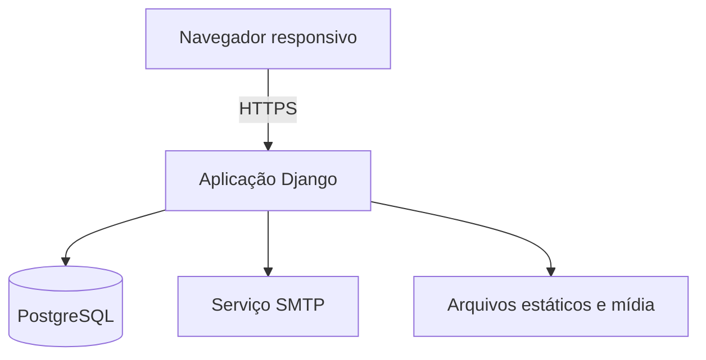
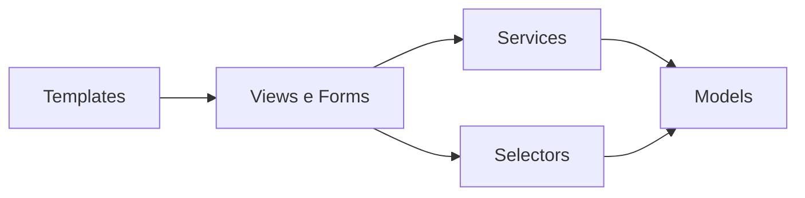

# Arquitetura da solução

## Estilo escolhido

A solução será um **monólito modular Django**, renderizado no servidor, com PostgreSQL. A separação interna seguirá módulos de negócio e camadas leves de apresentação, aplicação/domínio e persistência.

Essa abordagem atende ao conceito MVC/MTV solicitado pela disciplina, reduz a complexidade operacional e permite testar as regras de negócio isoladamente.

## Visão de execução



## Módulos planejados

| Módulo Django | Responsabilidade |
|---|---|
| `core` | classes base, utilitários comuns e página inicial |
| `accounts` | usuário customizado, autenticação e autorização |
| `people` | participantes, responsáveis, instrutores e instituições |
| `workshops` | oficinas, turmas, instrutores da turma e encontros |
| `enrollments` | inscrição, vagas, fila de espera e transições |
| `learning` | frequência, projetos, avaliação, conclusão e certificados |
| `reporting` | indicadores por escopo, filtros comuns e exportações CSV somente leitura |

## Estrutura executável planejada

```text
.
├── .github/workflows/
├── docs/
├── src/
│   ├── manage.py
│   ├── config/
│   │   ├── settings/
│   │   │   ├── base.py
│   │   │   ├── local.py
│   │   │   ├── production.py
│   │   │   └── test.py
│   │   ├── urls.py
│   │   ├── asgi.py
│   │   └── wsgi.py
│   ├── apps/
│   │   ├── core/
│   │   ├── accounts/
│   │   ├── people/
│   │   ├── workshops/
│   │   ├── enrollments/
│   │   ├── learning/
│   │   └── reporting/
│   ├── templates/
│   └── static/
├── tests/
├── pyproject.toml
└── README.md
```

Essa árvore será criada na etapa de bootstrap, junto às dependências e aos primeiros testes. Não haverá arquivos Python vazios apenas para simular progresso.

## Responsabilidades por camada

### Apresentação

- views recebem a requisição e coordenam a resposta;
- forms validam formato e dados de entrada;
- templates apresentam conteúdo sem concentrar regra de negócio;
- autorização é aplicada no servidor antes da execução da ação.

### Aplicação e domínio

- `services.py` executa comandos que alteram estado;
- transições de oficina, turma e inscrição ficam centralizadas;
- cálculo de frequência e conclusão possui funções determinísticas;
- regras com concorrência usam transações explícitas.

### Consulta e persistência

- models representam entidades e invariantes locais;
- `selectors.py` concentra consultas de leitura não triviais;
- constraints protegem unicidade e integridade no banco;
- views não montam consultas complexas diretamente.

## Fluxo de dependências



Módulos de domínio não dependem de templates. `reporting` pode consultar dados dos demais módulos, mas não deve alterar seus estados.

## Concorrência de vagas

A confirmação de inscrição será executada em `transaction.atomic()`. A turma será carregada com bloqueio de linha, a ocupação será recalculada e somente então a inscrição poderá ser confirmada. Essa decisão implementa RN-022 e RNF-018, evitando excesso de vagas em requisições simultâneas.

## Segurança

- modelo de usuário customizado definido antes da primeira migração;
- senhas e sessões gerenciadas pelo Django;
- CSRF habilitado em formulários;
- consultas via ORM e escape padrão nos templates;
- cookies seguros e HTTPS no ambiente publicado;
- segredos em variáveis de ambiente;
- checagem de papel e vínculo em cada operação;
- respostas de erro sem detalhes internos;
- dados de demonstração fictícios.

## Estratégia de configurações

- `base`: configuração compartilhada;
- `local`: desenvolvimento, debug e serviços locais;
- `test`: execução rápida e determinística;
- `production`: debug desativado e controles de segurança.

## Observabilidade mínima

- logs estruturados de erro e operações sensíveis;
- identificador temporal e autoria em frequência e avaliação;
- página de saúde para implantação;
- erros de aplicação registrados no servidor, sem dados sensíveis.

## Qualidade e integração contínua

Em cada pull request serão executados:

1. formatação e lint;
2. verificação das migrações;
3. testes automatizados;
4. relatório de cobertura;
5. verificações de segurança/configuração do framework.

## Estratégia de implantação

A aplicação deverá ser empacotada de forma reproduzível. O ambiente de produção terá aplicação web, PostgreSQL, arquivos estáticos, HTTPS, variáveis de ambiente e rotina de backup. O provedor será escolhido mais próximo da publicação, sem acoplar o domínio a uma plataforma específica.
